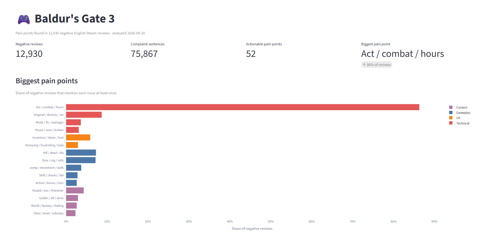

## Getting the data

Reviews aren't included in this repo. To download them:

```bash
pip install -r requirements.txt
python -m src.collect.steam --appid 1086940 --max 5000
```

This creates `data/reviews.db`.




